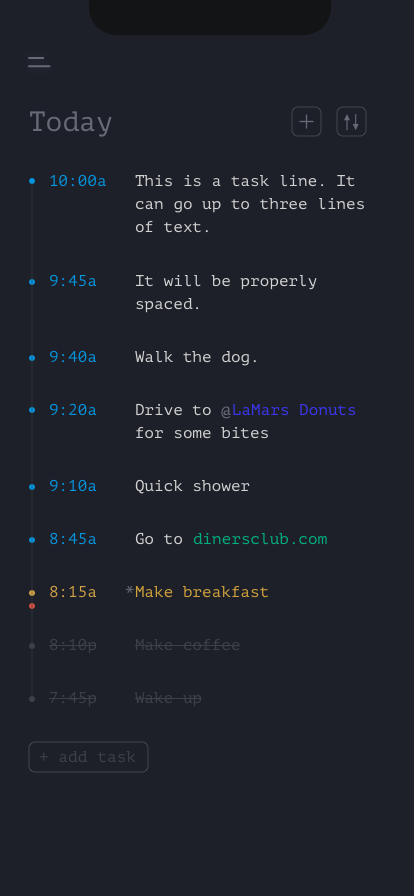

# today-todo-list-app
a list app that helps you reverse engineer a goal for that day.
Everyday I make a time-sensitive todo list.
If there is something I need to do at a specific time I reverse-engineer all the dependencies to accomplish that goal.
If my goal is to get some work done while sticking to my daily routine before an appointment at 9:30a, I can write something like this: 

    - 9:30a arrive.
    - 9:20a park (~25min drive)
    - 8:55a leave for appoinment
    - 8:50a return from walk
    - 8:20a walk the dog
    - 8:15a feed the dog
    - 7:45a shower/dress
    - 7:30a eat breakfast
    - 7:15a make breakfast
    - 5:35a work on app
    - 5:30a make coffee
  
Now I know what time I have to complete certain items in order to accomplish what I want while still making it to my appointment on time. 
  
Overtime this helps me better estimate how much time a task will take and has increased my punctuality. 
But makeing this list manually can be a bit tedious, especially if I want to adjust a time or add a task. I'll have to manually adjust each time mark after that change. 

Goal of this app is to somewhat automate part of the list making.
  Feature Ideas:
  
    - automatice List ordering
    - ability to flip list ordering (ascending/descending)
    - flexible times input (eg. 9 = 9:00am, 11:4p = 11:40pm, etc)
    - weblink detection
    - location detection to google maps

